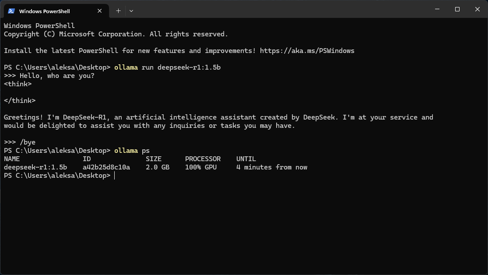

So you've got an AMD GPU that isn't on Ollama's official supported list, and you still want to run DeepSeek R1 locally? Yeah, I was in the same boat with my Radeon RX 6600 XT. The good news is that it's totally possible thanks to a community fork. Here's how I got it working.

If you want to check whether your GPU is officially supported, here's [AMD's list](https://ollama.com/blog/amd-preview). If yours isn't on there (like mine), keep reading.

## Before you start

A few things to take care of first:

- Make sure you have admin access on your Windows machine.
- If you already have the official Ollama installed, uninstall it. The community fork replaces it.
- You'll need to download some files, so have some disk space ready.

## How much VRAM do you need?

My RX 6600 XT has 8GB of VRAM, which worked fine for both `deepseek-r1:1.5b` and `deepseek-r1:7b`. If you want to squeeze out better performance, check out the [distilled and quantized versions](https://ollama.com/library/deepseek-r1/tags) in the Ollama model library. These compressed models can run smoother while using less VRAM.

If you're curious about the math behind VRAM requirements and how quantization works, [this video explains it really well](https://www.youtube.com/watch?v=IJufykNYGRs).

## Step 1: Install the community Ollama fork

Since the official Ollama doesn't support our GPUs, we need the community version:

1. Uninstall official Ollama if you haven't already.
2. Head to the [Ollama for AMD releases page](https://github.com/likelovewant/ollama-for-amd/releases).
3. Download the latest `OllamaSetup.exe` (I used v0.5.4 at the time, but grab whatever's newest).
4. Run the installer. Pretty straightforward.

## Step 2: Figure out your GPU architecture

You need to know your GPU's LLVM target so we can grab the right ROCm libraries:

1. Check the [AMD GPU Arches list](https://github.com/likelovewant/ollama-for-amd/wiki/AMD-GPU-Arches-lists-Info) or the [ROCm docs](https://rocm.docs.amd.com/projects/install-on-windows/en/develop/reference/system-requirements.html) (look at the "AMD Radeon" tab).
2. Find your GPU model. For the RX 6600 XT, the LLVM target is `gfx1032`.

Write that down, you'll need it in the next step.

## Step 3: Download ROCm libraries

ROCm is AMD's platform for GPU computing. We need some pre-built libraries to make everything work:

1. Go to the [pre-built ROCm libraries repo](https://github.com/likelovewant/ROCmLibs-for-gfx1103-AMD780M-APU/releases).
2. Find a release that matches your GPU's LLVM target (`gfx1032` in my case).
3. Download the ZIP file and extract it somewhere you can find it.

I used v0.6.2.4, though v0.6.1.2 is also a safe bet.

## Step 4: Swap out the files in Ollama's install folder

Now we need to replace a couple of files so Ollama knows how to talk to your GPU:

1. Open your Ollama install directory. It's usually at:
   ```bash
   C:\Users\[YourUsername]\AppData\Local\Programs\Ollama\lib\ollama
   ```
2. Find `rocblas.dll`, rename it to `rocblas.dll.backup`, then copy the new one from the extracted ROCm files.
3. Now go into the `rocblas` subfolder:
   ```bash
   C:\Users\[YourUsername]\AppData\Local\Programs\Ollama\lib\ollama\rocblas
   ```
4. Rename the `library` folder to `library_backup`, then copy the new `library` folder from the extracted files.

## Step 5: Run DeepSeek R1

The hard part is done. Let's actually run the model:

1. Open a terminal and run:
   ```bash
   ollama run deepseek-r1:1.5b
   ```
2. It'll download the model first (might take a few minutes depending on your internet). After that, you're in a chat interface.



3. When you're done chatting, type:
   ```bash
   /bye
   ```

## Step 6: Make sure it's actually using your GPU

Let's double-check that the model is running on the GPU and not falling back to CPU:

1. Run:
   ```bash
   ollama ps
   ```
2. You should see something like `100% GPU`. If you do, you're golden.

Some other handy commands:

- See all your installed models:
  ```bash
  ollama list
  ```
- Stop a running model:
  ```bash
  ollama stop deepseek-r1:1.5b
  ```
- Run with verbose mode to see how fast it's going:
  ```bash
  ollama run deepseek-r1:1.5b --verbose
  ```

## Quick heads up about updates

If you're using a demo release, **don't** click "Update" if Ollama prompts you. That'll overwrite the community fork with the official version and break everything. Instead, grab updates manually from the [releases page](https://github.com/likelovewant/ollama-for-amd/releases).

There's also a neat tool called [Ollama-For-AMD-Installer](https://github.com/ByronLeeeee/Ollama-For-AMD-Installer) by [ByronLeeeee](https://github.com/likelovewant/ollama-for-amd/issues/21) that handles updates and library swaps with one click.

For another perspective, Major Hayden wrote a one‑page guide to [running ollama with an AMD Radeon 6600 XT](https://major.io/p/ollama-with-amd-radeon-6600xt/).

## That's it

Once everything's set up, you've basically got a local AI chatbot running on a GPU that AMD and Ollama said wouldn't work. Gotta love the open source community. If you run into issues, the [Ollama for AMD Wiki](https://github.com/likelovewant/ollama-for-amd/wiki) has some good troubleshooting info. Happy tinkering!
