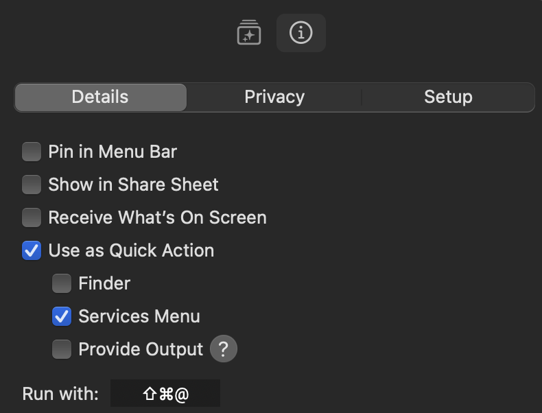
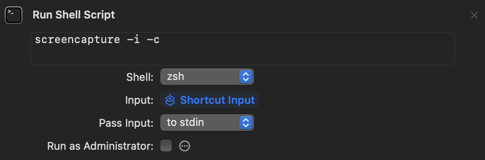
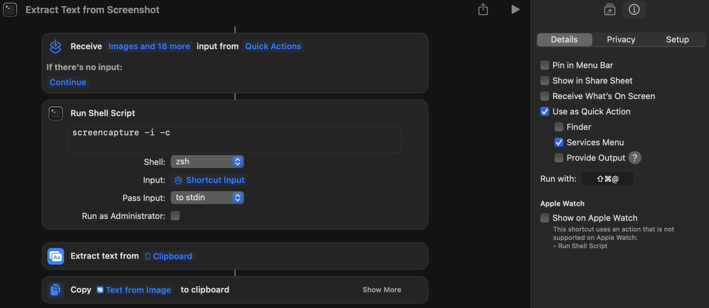
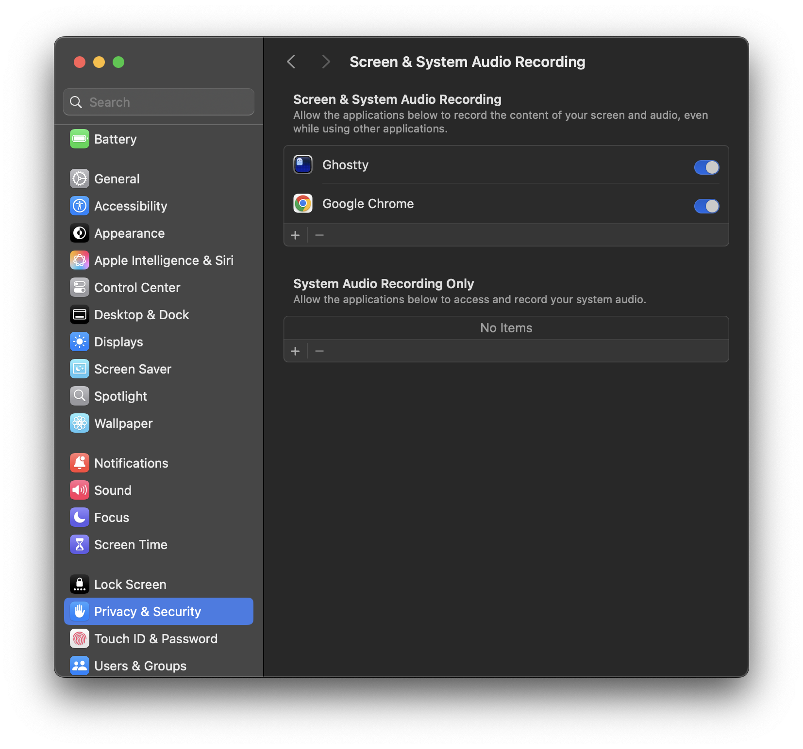

When I switched to Mac, the thing I missed most from Windows was `Win + Shift + T`.

If you've used Windows PowerToys, you know the workflow: hit the hotkey, drag a crosshair over some un-copyable text in a video or image, and it's instantly on your clipboard.

Apple still hasn't built a native global hotkey for this, even in macOS Tahoe. Instead, [people are forced to buy paid third-party apps](https://www.reddit.com/r/MacOS/search?q=Is+there+a+way+to+automatically+copy+text+from+screenshots+to+the+clipboard&restrict_sr=on) like [TextSniper](https://textsniper.app) or [CleanShot X](https://cleanshot.com) just to get this one feature.

Apple's built-in Live Text only works well if you're already in Preview or Safari. Otherwise, getting actual text from your screen means taking a screenshot, saving it to your desktop, opening it, selecting the text, and then deleting the junk file. It completely breaks your momentum.

I just wanted that simple global hotkey back. No clunky menus, and no third-party apps eating RAM in the background.

You can actually build this natively using the macOS Shortcuts app. I bound mine to `Cmd + Shift + 2`. It takes two minutes to set up, and after wrestling with macOS privacy sandboxing once, it works perfectly forever. Here is how to do it.

### 1. Enable it as a Quick Action

Open the **Shortcuts** app and create a new shortcut. Before adding scripts, look at the right sidebar (click the "Shortcut Details" icon `(i)` at the top right if it's hidden).

Check the box for **Use as Quick Action**, and make sure **Services Menu** is also checked beneath it. This is the secret sauce that registers the script globally as a system service. Without this checked, your hotkey won't do anything when you're using other apps like Chrome.

Next, look at the **Run with:** field at the very bottom of this sidebar panel. Click it and press `Cmd + Shift + 2` to bind your global hotkey. Note that macOS will display this visually as `⇧⌘@` because holding Shift and pressing 2 types the `@` symbol.



### 2. The Capture Script

Search for the **Run Shell Script** action in the right sidebar and drag it into your workspace. Replace the default text with this:

```bash
screencapture -i -c
```

Here's what that does. The `-i` triggers the interactive crosshair. The `-c` forces the image straight to your clipboard instead of saving a physical file.



### 3. Extract and Copy the Text

Now we run OCR (Optical Character Recognition) on the image we just shoved into the clipboard.

Search for the **Extract Text from Image** action and drag it below your script.

Because Shortcuts tries to auto-link actions, it will incorrectly default to saying `Extract text from Shell Script Result`. We need to fix this:

1. Click on the blue **Shell Script Result** bubble and click **Clear Variable**.
2. The action will now say `Extract text from Image`.
3. Click the faded **Image** text, and select **Clipboard** from the dropdown menu.

Finally, add a **Copy to Clipboard** action at the very bottom. Make sure it is set to copy the `Text from Image` variable from the previous step.

Your final setup should look exactly like this:

1. **Receive any input from Quick Actions**
2. **Run Shell Script** (`screencapture -i -c`)
3. **Extract text from `Clipboard`**
4. **Copy `Text from Image` to clipboard**



### 4. The Wallpaper Symptom (And How to Fix It)

The first time you use this, you might run into a weird bug: you try to capture some text, but when you hit paste, it pastes a picture of your bare desktop background instead.

This happens because of macOS privacy sandboxing. Since the script runs in the background, macOS assumes the foreground app (like Chrome) is secretly recording your screen. To protect you, it blocks the window and captures your wallpaper instead. Because there is no text on your wallpaper, the extraction step finds nothing, and the shortcut defaults to pasting that raw image of your desktop.

The fix is simple. When macOS throws a prompt asking if the app can record your screen, **say yes**. You can also manually toggle this in `System Settings -> Privacy & Security -> Screen Recording & System Audio Recording` for each app where you want to use this shortcut.



Authorizing this app-by-app is slightly annoying, but realistically, you only need it for a few core apps like your browser and terminal. It's a small price to pay for a lightning-fast native OCR workflow.
