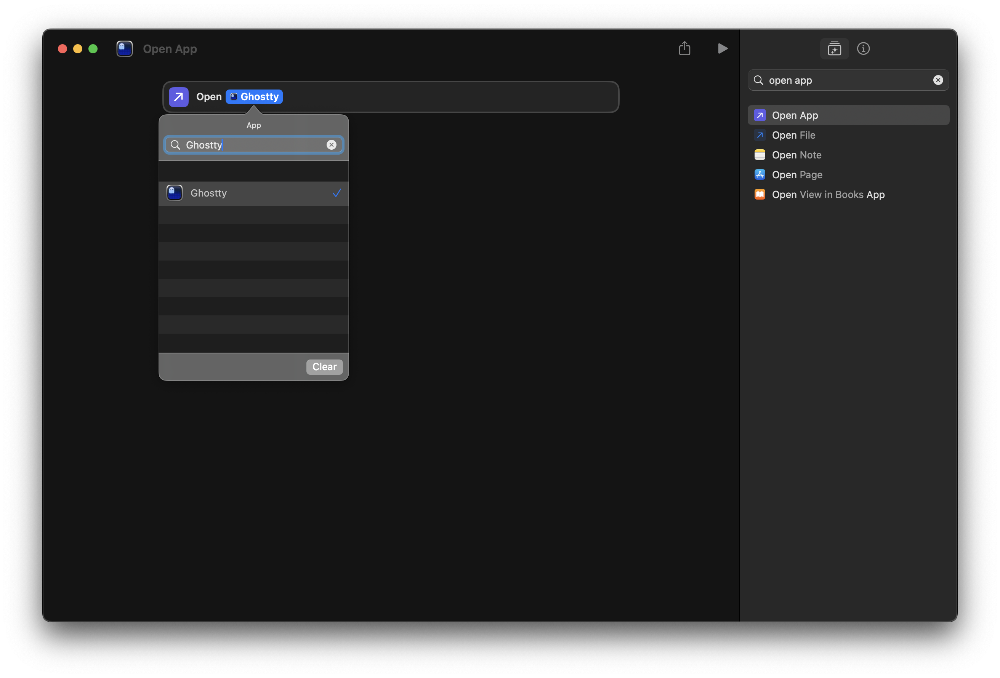
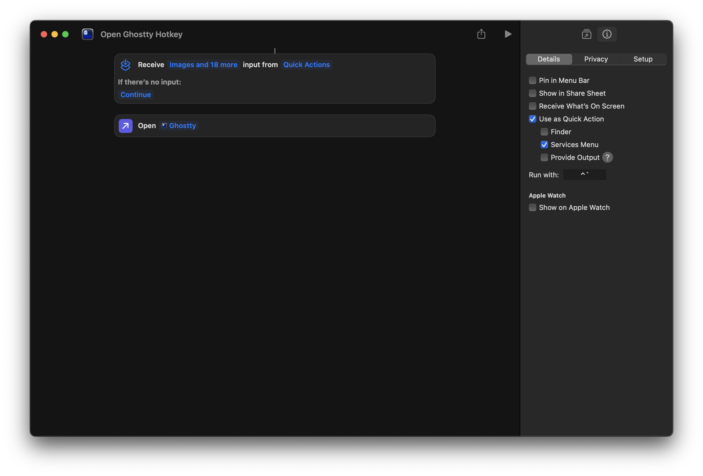

I recently made Ghostty my default macOS terminal. I love it, but I immediately missed my old Ubuntu setup where pressing ``Ctrl + ` `` (Control + Backtick) yanked the terminal to the front no matter what app I was using.

Ghostty has a built-in "Quick Terminal" config, but honestly, it kind of sucks. It opens this weird floating drop-down window instead of your actual main terminal instance. To make matters worse, if you ever Cmd + Q quit the app, the hotkey just dies.

I wanted my main terminal, and I wanted the hotkey to work 100% of the time, even from a cold start.

You can actually fix this in about thirty seconds using Apple's native Shortcuts app.

1. Hit Cmd + Space and open the Shortcuts app.
2. Click the "+" at the top to make a new shortcut.
3. Search for "Open App" and add it to the workflow.
4. Click the faint blue "App" text and pick Ghostty.

5. Over in the right sidebar (the 'i' icon), click "Add Keyboard Shortcut."
6. Smash your combo of choice. I use ``Ctrl + ` ``.

You're done. When you press the shortcut, macOS focuses Ghostty. If Ghostty is closed, it launches it. No dead hotkeys.

The best part about doing it at the OS level instead of using a third-party window manager is how it interacts with code editors. If you use VSCode, you know ``Ctrl + ` `` toggles the integrated terminal. Because of how macOS handles app focus, VSCode will intercept the hotkey when you're coding, so ``Ctrl + ` `` gives you the VSCode terminal. But when you're anywhere else, it summons Ghostty. Best of both worlds.
