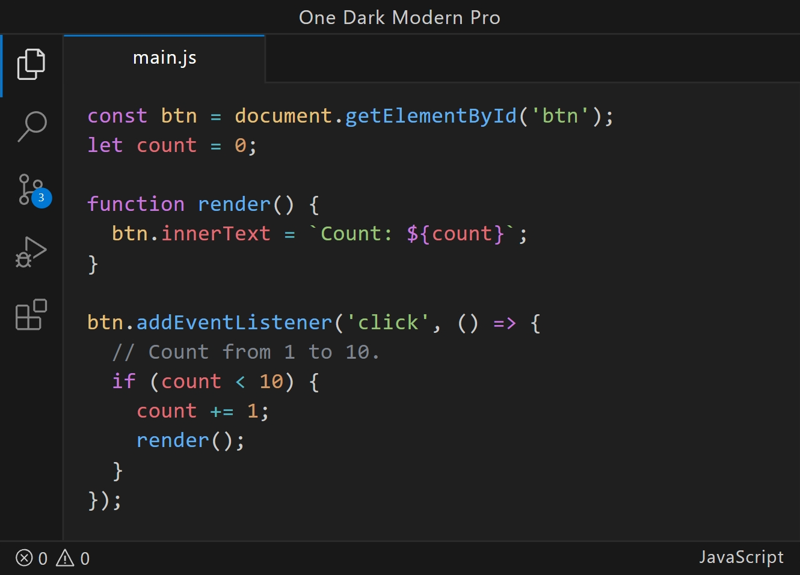

As a web developer, I’ve spent a lot of time searching for the perfect dark theme for my editor. I’ve been using Atom’s iconic **[One Dark Pro](https://marketplace.visualstudio.com/items?itemName=zhuangtongfa.Material-theme)** theme, specifically its darker variant, for quite a while. It’s one of the most installed themes for VS Code, and I love its syntax highlighting. However, even the darker variant didn’t quite hit the mark for me. I also really liked the clean look of the native **[Dark Modern](https://github.com/microsoft/vscode/blob/main/extensions/theme-defaults/themes/dark_modern.json)** theme in VS Code, but I missed the syntax colors from One Dark Pro. So, I made my own theme.

## One Dark Modern Pro ⚛️

A **VS Code theme** that combines the best of both worlds:

- Syntax highlighting from Atom’s One Dark theme, which I’ve always loved.
- Clean UI colors by VS Code's Dark Modern theme, that don’t distract from the code.
- A darker background that helps with focus and reduces eye strain.

## Try It Out

If you’ve been looking for the perfect dark theme that balances great syntax highlighting with a refined UI, give **One Dark Modern Pro** a try.

🔗 [VS Code Marketplace](https://marketplace.visualstudio.com/items?itemName=aleksa-codes.one-dark-modern-pro)\
🔗 [GitHub Repo](https://github.com/aleksa-codes/one-dark-modern-pro)

## Bonus Font and Icons Recommendations

To complete the experience, I recommend using **Source Code Pro** for the font. It pairs beautifully with the One Dark Modern Pro theme and provides a clean, monospaced look that makes reading code effortless.

🔗 [Source Code Pro on GitHub](https://github.com/adobe-fonts/source-code-pro)

For icons, I highly recommend the **Bearded Icons** set. It’s a great match for the sleek look of One Dark Modern Pro and gives your editor a modern, minimal aesthetic.

🔗 [Bearded Icons on VS Code Marketplace](https://marketplace.visualstudio.com/items?itemName=BeardedBear.beardedicons)
