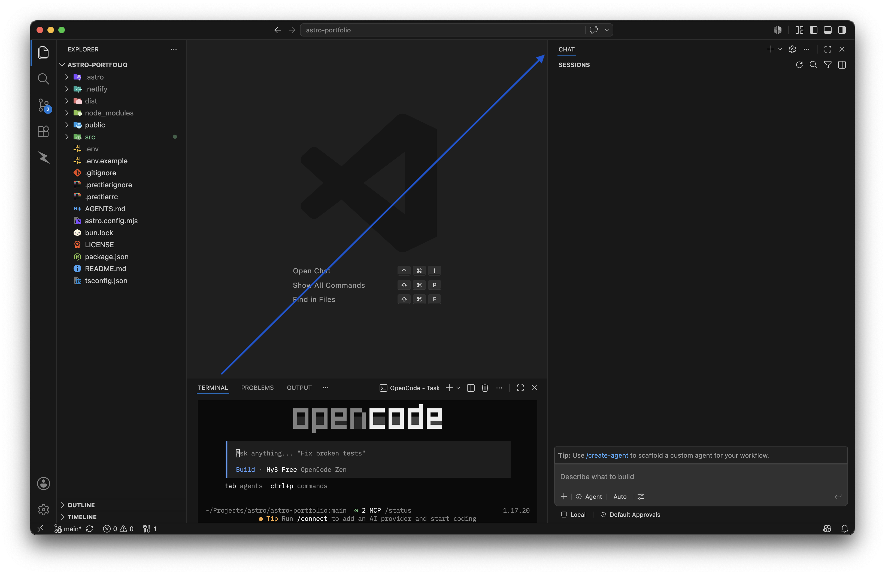
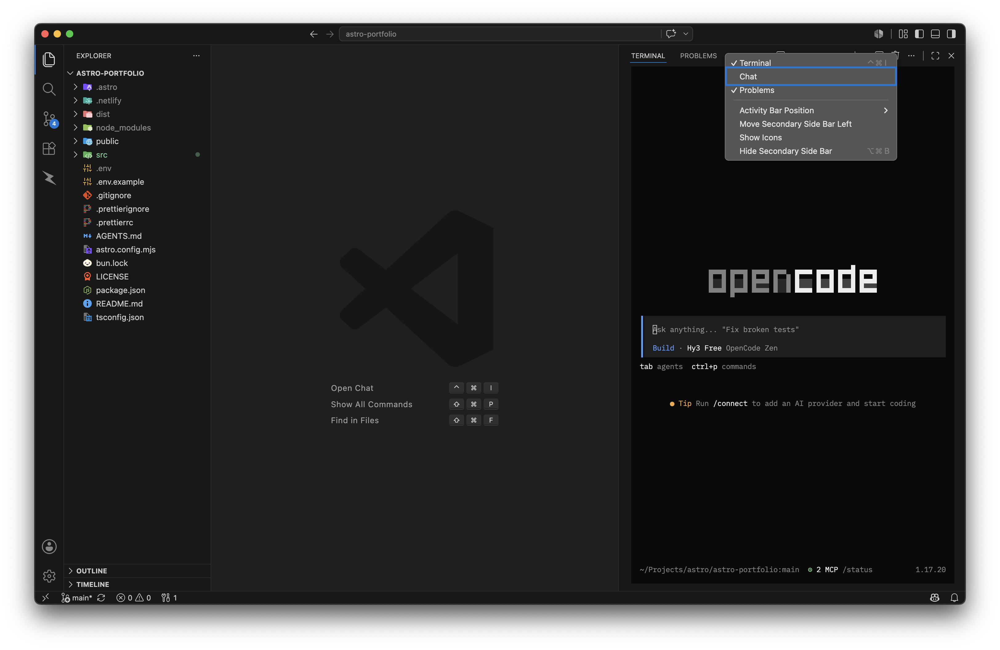
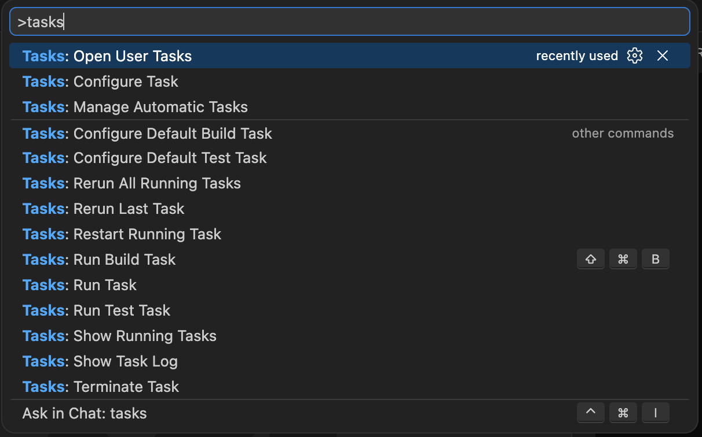

I've been a GitHub Copilot user for a long time, but the recent pricing changes and the nerfs to the student plan finally made me stop using it. I switched to the free OpenCode models instead. Honestly, it's been great. I'm even considering grabbing OpenCode Go since the value actually makes sense.

If you spend any time on X (Twitter), you've probably seen the current meta: IDEs are dead. Between terminal setups like Ghostty running an AI TUI, Cursor, and the Claude desktop app, people keep preaching that we don't even need IDEs anymore and that we don't even have to look at the code ourselves. I get it, but I still want VS Code. I like having my file tree. I like the Source Control UI for checking diffs and hitting the AI commit message button.

I know I could just keep Ghostty open next to VS Code and `cmd + tab` between them. But I hate window clutter. My brain only wants to toggle between Chrome and my editor.

So, I set up VS Code to treat the OpenCode TUI exactly like the Copilot chat window. Here's how to do it.

### 1. Install the TUI

I'm on a Mac, so Homebrew makes this easy. One quick warning: don't just run `brew install opencode`. That actually points to an unofficial formula that is way behind on versions. You want to use their official tap instead:

```bash
brew install anomalyco/tap/opencode
```

(Windows users, just check their docs for the install command).

### 2. Fix the layout

VS Code insists on putting the terminal at the bottom of the screen, which is terrible for reading AI generated code.

Open your terminal (``ctrl + ` ``). Open the Copilot Chat tab so it appears on the right sidebar. Now just click and drag the "Terminal" tab from the bottom panel over to that right sidebar.



I also like to drag my "Problems" tab over there too. Honestly, next to the terminal, it is pretty much the only bottom-panel tab I actually use. It is great for clearing out random errors, but I usually keep it handy to quickly resolve issues like the Tailwind CSS `suggestCanonicalClasses` warnings. Once everything is over there, right-click the top of the sidebar, find "Chat", and untick it to hide Copilot for good. You will be left with a clean setup of just your terminal and errors.



### 3. Automate the startup

The layout is fixed, but having to manually type `opencode` every time you open a project is annoying. We can bypass that with a User Task.

Pop open the command palette (`cmd + shift + p`) and run **Tasks: Open User Tasks**.



Once you select that, a `tasks.json` file will open up. You can just replace the existing file content (or append this block to your active tasks array) with this configuration:

```json
{
  "version": "2.0.0",
  "tasks": [
    {
      "label": "OpenCode",
      "type": "process",
      "command": "opencode",
      "isBackground": true,
      "runOptions": {
        "runOn": "folderOpen"
      },
      "presentation": {
        "reveal": "always",
        "panel": "dedicated",
        "focus": false
      }
    }
  ]
}
```

Here is a quick breakdown of what the crucial settings actually do:

- `isBackground: true` keeps the task running smoothly in the background without blocking your editor or forcing you to manually manage it.
- `runOn: "folderOpen"` is the real trick here. It tells VS Code to fire up this task automatically the second you open a workspace.
- `reveal: "always"` ensures that the terminal panel is always visible when the task starts, so you can see the TUI right away.
- `panel: "dedicated"` ensures the TUI gets its own dedicated terminal tab, rather than hijacking whatever standard terminal panel you already had active.
- `focus: false` prevents the terminal from stealing focus when it starts.

That's it. Now whenever you run `code .` in a directory, VS Code opens with the OpenCode TUI already spinning up in the right panel. You get the exact same UI real estate as Copilot, zero window clutter, and you don't have to pay for a subscription you don't want.
